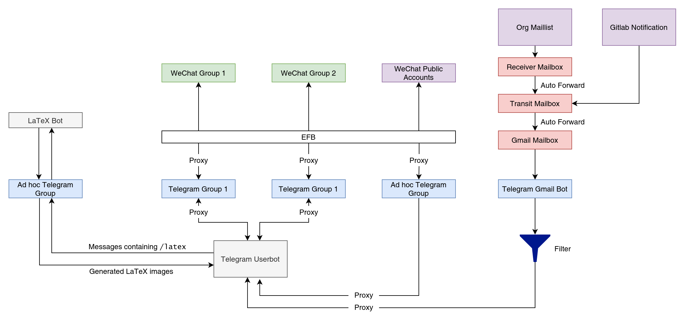

# yao-bridge

Bridging messages among Yao groups

## TERMS OF SERVICE (V1.0)

1. 本服务可能会保存用户的信息，包括但不限于用户的 ID（包括用户名，群内昵称，Sharzy 对该用户的备注），消息内容。由于架构的原因，这些信息可能会保存在 Sharzy 个人的服务器以及 Telegram 的服务器上。
2. 我们不对服务有任何保证，我们也不对服务产生的任何后果负责。我们可能在任何时候停止、暂停或维护该服务，由于个人或者微信端的原因。
3. 目前本服务不支持消息的撤回，也不支持红包等微信高级功能。我们稍后会对本项目的架构和代码进行说明和开源。有兴趣的同学可以自行研发撤回等功能。

## TODO LIST

1. 我们的服务支持任意多的群组，我们可能会在未来加入 Telegram 群组「姚班后花园」的支持。
2. 我们的服务需要一个更科学的架构，目前运营在个人帐号上，未来可能运营在更科学的帐号上。

## Architecture

我们依赖如下服务：

1. [EFB bot](https://github.com/ehForwarderBot/)
2. [Telethon](https://github.com/LonamiWebs/Telethon/)

我们用第一个工具搭建了一个 WeChat bot，它可以将微信端的所有支持的消息转发到 Telegram 上，也可以将 Telegram 的某些信息转发回到微信中。同时也可以将微信某个群组的消息转发到特定的 Telegram 群组中。我们又使用第二个工具搭建了一个 user bot，该 bot 实现了将一个 Telegram 群组的消息转发到另一个 Telegram 群组的功能（目前的设计下可以转发任意多的群组）。

在这两个 bot 的帮助下，我们新建了两个 Telegram 群组，分别对应（微信上的）大群和二群，我们令 WeChat Bot 将两个微信群的消息分别转发到这两个 Telegram 群组中，然后使用 user bot 转发这两个群的消息，这两个群的消息便会被 WeChat bot 转发回微信端，实现微信两个群的消息同步。

除此之外，我们还通过多种方式来将更多消息转发到群组中。目前实现的部分如下：

1. 邮件列表中的邮件。我们先设置自动转发，将所有邮件转发到 Gmail（由于 Gmail 的可连通性不佳，我们实际还使用了一个邮箱作为中转），接着使用 Telegram Gmail bot 接受邮件，让 user bot 将符合条件的邮件转发到对应的群组中，并由 EFB 同步到微信。
2. 活动室使用申请。我们使用一个学校自建的 Gitlab 服务中搭建一个仓库，使用申请通过向这个仓库提 issue 发出，当有新 issue 或者该仓库的其它动态出现时，Gitlab 服务会发送一封邮件，我们将这封邮件转发到 Gmail，接下来的步骤和 1 相同。
3. 特定的公众号文章。在 Telegram 中建立一个群组，将需要转发的公众号链接到这个群组，user bot 会侦听这个群组，当这些公众号有新文章发布时，user bot 将对应的消息转发到对应的 Telegram 群，并由 EFB 同步到微信。

为了方便在群内进行学术讨论，我们还支持根据聊天消息中的 LaTeX 代码生成图片发送到群中。使用方法如下：发送消息时，如果消息的文本中包含有 `/latex` （注意是正斜杠而不是 LaTeX 代码中常见的反斜杠），那么在 `/latex` 之后的所有文本均会被视为 LaTeX 代码编译，并且转换为图片发送到群中。实现细节见下文的图示。

我们目前的架构如下图所示：

## Deployment

我们的 WeChat Bot 是按照 [efb-wechat-slave](https://github.com/ehForwarderBot/efb-wechat-slave/) 中提供的方式部署的。

我们的 user bot 代码位于项目的 [userbot.py](userbot.py) 中。注意需要自行填写相关的参数。

## Credit

Architecture design: [Zenithal](https://github.com/ZenithalHourlyRate/)

